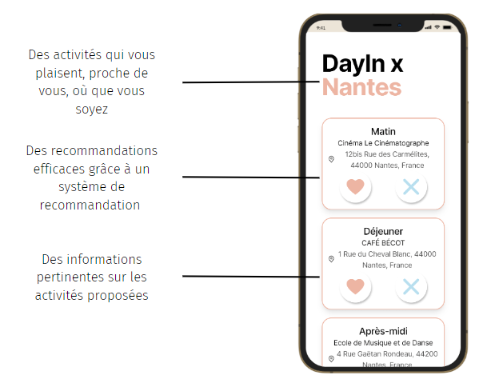
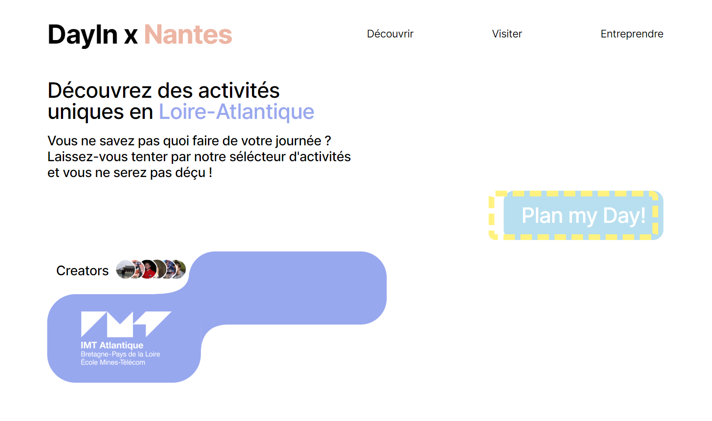
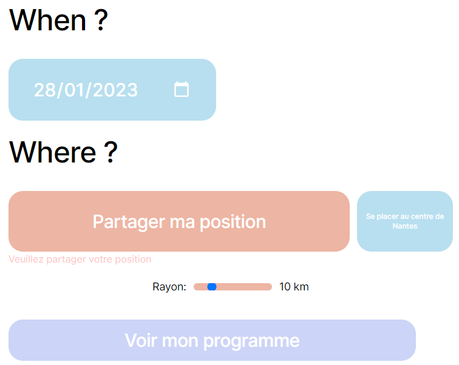
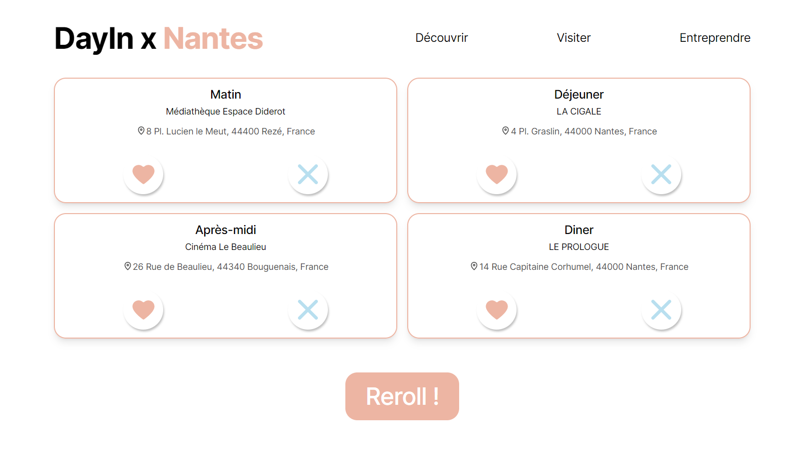
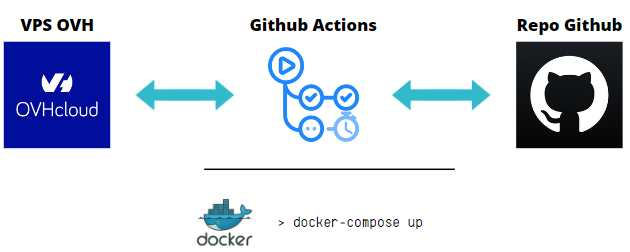
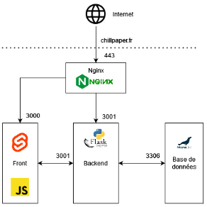

[![Contributors][contributors-shield]][contributors-url]
[![Forks][forks-shield]][forks-url]
[![Issues][issues-shield]][issues-url]
[![MIT License][license-shield]][license-url]

<!-- PROJECT LOGO -->
<br />
<div align="center">
  <a href="https://chillpaper.fr">
    
  </a>

  <h3 align="center"><strong>Hackaton 2023</strong></h3>

  <p align="center">
    Solution proposée durant l'UE Hackaton de l'option LOGIN à l'IMT Atlantique
    <br />
    <br />
    <a href="https://github.com/remiCzn/Hackathon_IMT_3A/issues">Signaler un problème</a>
    ·
    <a href="https://github.com/remiCzn/Hackathon_IMT_3A/issues">Proposer une amélioration</a>
  </p>
</div>

<!-- ABOUT THE PROJECT -->

## À propos du projet

**Problème et Contexte :**

_Titre : Comment utiliser l'open-data de la ville de Nantes pour répondre à une problématique, le tout implémenté en intégration et développement continu ?_

La ville de Nantes a mis à disposition des données ouvertes sur le site de la municipalité. Ces données sont disponibles sous forme de fichiers CSV, JSON, XML, etc. Ces données sont mises à jour régulièrement et sont accessibles à tous. Le but de ce projet est de proposer une solution qui utilise ces données pour répondre à une problématique.

Tout commence d'un constat : 75% des gens qui viennent à Nantes ne savent pas quoi visiter et où manger. Et 60% du public interrogé ne sait pas quoi faire de son week-end. Pour répondre à cela nous avons eu l'idée de développer une application web qui permettrait de répondre à ces problématiques.

# Notre solution

## L'idée

Notre idée est très simple : Il s'agit d'un plannificateur de journée. L'utilisateur peut choisir un rayon autour de lui et notre application lui proposera des activités et des restaurants à proximité, minimisant la distance à parcourir en prennant en compte les horaires.

Il peut ensuite choisir ce qu'il veut faire et noter ses préférences. L'application lui proposera ensuite une journée complète, un endroit à visiter le matin, un lieu pour déjeuner le midi, un endroit à visiter l'après-midi et un lieu pour dîner le soir.

<div align="center">
  
  <p>Notre solution, simple réactivte et accessible</p>
</div>

## Le site

<div align="center">
  
  <p>Landing page</p>
</div>

<div align="center">
  
  <p>Recherche autour d'un rayon défini</p>
</div>

<div align="center">
  
  <p>Résultats d'une recherche</p>
</div>

# Informations techniques

## Comment lancer le projet localement ?

Notre projet se lance avec Docker. Pour le lancer, il suffit d'executer les commandes suivantes :

```sh
docker-compose build
docker-compose up
```

## Méthode de CI-CD employée

<div align="center">
  
  <p>Notre pipeline sur-mesure d'intégration et de développement continue</p>
</div>

## Architecture générale

<div align="center">
  
  <p>Notre architecture globale</p>
</div>

## Built With

- [![Svelte][svelte.dev]][svelte-url]
- [![Python][python.dev]][python-url]
- [![MariaDB][mariadb.dev]][mariadb-url]
- [![NGINX][nginx.dev]][nginx-url]

<!-- LICENSE -->

## License

Distributed under the MIT License. See `LICENSE.txt` for more information.

<!-- MARKDOWN LINKS & IMAGES -->
<!-- https://www.markdownguide.org/basic-syntax/#reference-style-links -->

[contributors-shield]: https://img.shields.io/github/contributors/remiCzn/Hackathon_IMT_3A.svg?style=for-the-badge
[contributors-url]: https://github.com/remiCzn/Hackathon_IMT_3A/graphs/contributors
[forks-shield]: https://img.shields.io/github/forks/remiCzn/Hackathon_IMT_3A.svg?style=for-the-badge
[forks-url]: https://github.com/remiCzn/Hackathon_IMT_3A/network/members
[issues-shield]: https://img.shields.io/github/issues/remiCzn/Hackathon_IMT_3A.svg?style=for-the-badge
[issues-url]: https://github.com/remiCzn/Hackathon_IMT_3A/issues
[license-shield]: https://img.shields.io/github/license/remiCzn/Hackathon_IMT_3A.svg?style=for-the-badge
[license-url]: https://github.com/remiCzn/Hackathon_IMT_3A/blob/master/LICENSE.txt
[basic-shield]: https://img.shields.io/badge/Prix%20du%20public-555555?style=for-the-badge
[svelte.dev]: https://img.shields.io/badge/Svelte-4A4A55?style=for-the-badge&logo=svelte&logoColor=FF3E00
[svelte-url]: https://svelte.dev/
[python.dev]: https://img.shields.io/badge/Python-4A4A55?style=for-the-badge&logo=python
[python-url]: https://www.python.org/
[mariadb.dev]: https://img.shields.io/badge/Mariadb-4A4A55?style=for-the-badge&logo=mariadb
[mariadb-url]: https://www.python.org/
[nginx.dev]: https://img.shields.io/badge/Nginx-4A4A55?style=for-the-badge&logo=nginx
[nginx-url]: https://www.python.org/
